# Capture-to-Guest Pipeline Telemetry & Latency Specifications

## Overview
The Capture-to-Guest pipeline measures the exact elapsed time for every photo from the moment it is received by Get My Moment until all derivatives (thumbnails, YuNet face detections, SFace embeddings, pgvector records) are indexed and available in the live guest gallery.

---

## Canonical Pipeline Stages

```mermaid
graph LR
    Camera[Camera / Web] -->|HTTP / FTP| Ingest[RECEIVED]
    Ingest -->|SHA256 & Dimensions| Storage[STORED]
    Storage -->|Dispatch| Queue[QUEUED]
    Queue -->|Worker Pickup| Worker[PROCESSING]
    Worker -->|Thumbnails| Thumb[THUMBNAILS]
    Thumb -->|YuNet + SFace| AI[AI_INFERENCE]
    AI -->|pgvector Commit| Ready[GUEST_READY]
```

1. **RECEIVED (`created_at`):** File stream arrives at server (FastAPI multipart or FTP socket).
2. **STORED (`created_at`):** File bytes written to disk/storage driver with SHA-256 calculation.
3. **QUEUED (`queued_at`):** Task payload dispatched to Redis broker / Celery queue.
4. **PROCESSING (`processing_started_at`):** Background worker picks up task from queue.
5. **AI_INFERENCE (`ai_inference_ms`):** OpenCV YuNet 5-landmark face detection and SFace 128-d embedding extraction.
6. **GUEST_READY (`guest_ready_at`):** Database transaction committed; photos searchable via guest face selfie matcher.

---

## Latency Metrics

- **Upload-to-Guest-Ready:**
  `delta_t_upload = guest_ready_at - created_at`
- **Queue Wait Time:**
  `delta_t_queue = processing_started_at - queued_at`
- **Worker Execution Duration:**
  `processing_duration_ms = (Worker End - Worker Start) * 1000`
- **AI Inference Time:**
  `ai_inference_ms = (YuNet + SFace) * 1000`

---

## Timezone Convention
All timestamp fields stored in the database and exposed via the API follow **UTC** semantics.
