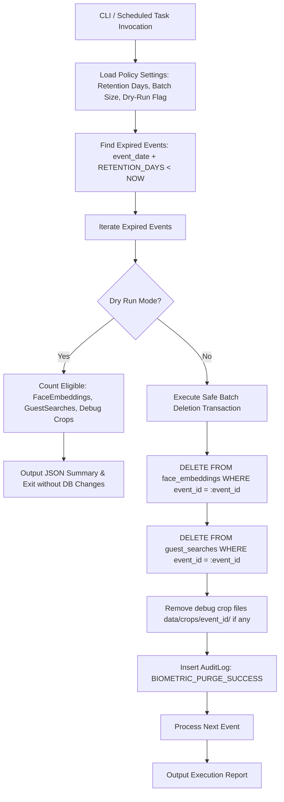

# Get My Moment — Biometric Purge Engine Architecture Design (SEC-04)

**Status:** `DESIGN ONLY — PENDING POLICY APPROVAL (ZERO DATA DELETED)`  
**Target Module:** `apps/api/services/biometric_purge_service.py` (Proposed)  
**CLI Tooling:** `scripts/purge_biometrics.py` (Proposed)  

---

## 1. ARCHITECTURAL REQUIREMENTS & INVARIANTS

The Biometric Purge Engine is designed around strict non-destructive, privacy-safe architectural invariants:

1. **Zero Cascade Damage to Media:** Original high-resolution photos (`photos`), thumbnails (`_thumb.jpg`), folders, client selections, and client payment records are **NEVER** touched or deleted.
2. **Consent & Audit Preservation:** Consent logs (`consents`) and security logs (`audit_logs`) are **IMMUTABLE** and preserved for legal compliance under DPDP Act / GDPR.
3. **Tenant & Event Scoping:** Every SQL operation is strictly partitioned by `event_id` and `photographer_id`. Cross-tenant deletes are structurally impossible.
4. **Batch Processing & Bounded Execution:** Deletions operate in configurable chunk sizes (e.g. `BATCH_SIZE = 500`) to avoid PostgreSQL locking and transaction log bloat.
5. **Idempotency & Resume Safety:** If interrupted, re-running the job picks up safely where it left off.
6. **No Biometric Data Logging:** Logs record integer counts and event IDs; raw embeddings, hashes, and PII are never printed.
7. **Mandatory Dry-Run Mode:** Supports `--dry-run` to output eligible purge statistics without executing SQL transactions.

---

## 2. PURGE EXECUTION FLOW



---

## 3. PROPOSED IMPLEMENTATION FILES & MODULES

When approved, the implementation will introduce:

1. **`apps/api/services/biometric_purge_service.py`**:
   - `class BiometricPurgeService`:
     - `get_eligible_expired_events(db, retention_days: int) -> List[Event]`
     - `dry_run_event_purge(db, event_id: str) -> Dict[str, int]`
     - `purge_event_biometrics(db, event_id: str, batch_size: int = 500) -> Dict[str, int]`
2. **`scripts/purge_biometrics.py`**:
   - CLI script with arguments: `--dry-run`, `--event-id`, `--retention-days`, `--batch-size`.
3. **`tests/security/test_biometric_purge.py`**:
   - Automated pytest suite verifying all 15 test scenarios defined below.

---

## 4. DRY-RUN CLI SPECIFICATION

```bash
# Example Dry-Run Execution (Safe, Read-Only):
python scripts/purge_biometrics.py --dry-run --retention-days 90

# Output Schema:
{
  "dry_run": true,
  "retention_days": 90,
  "anchor_field": "event_date",
  "eligible_events_count": 3,
  "eligible_data": {
    "face_embeddings_count": 45,
    "guest_searches_count": 12,
    "debug_crops_count": 0
  },
  "protected_data": {
    "photos_preserved": 450,
    "consents_preserved": 12,
    "guests_preserved": 12
  },
  "status": "DRY_RUN_COMPLETED"
}
```

---

## 5. BACKUP RECONCILIATION STRATEGY

When a historical PostgreSQL backup archive (e.g. `gmm_backup_*.dump`) is restored onto the server:
- **Challenge:** Restoring an older full database backup will restore previously purged `face_embeddings` and `guest_searches`.
- **Reconciliation Protocol:** The disaster-recovery runbook (`docs/runbooks/backup-restore.md`) includes a post-restore reconciliation step:
  `python scripts/purge_biometrics.py --execute` to immediately re-apply the approved retention policy and re-purge data for expired events.

---

## 6. COMPREHENSIVE TEST PLAN (FOR IMPLEMENTATION PHASE)

1. **Event Scoping Isolation:** Purge on Event A cannot delete embeddings or searches in Event B.
2. **Studio Isolation:** Photographer A purge cannot touch Photographer B's events.
3. **Photo Preservation:** `photos` table rows and disk files remain 100% intact after purge.
4. **Thumbnail Preservation:** `thumbnails` and `processed` images remain 100% intact.
5. **Consent Invariance:** `consents` table rows are strictly preserved.
6. **Client Selection Invariance:** Proofing folders and client selections remain intact.
7. **Dry-Run Immutability:** Running `--dry-run` performs 0 deletes and modifies 0 database records.
8. **Idempotency:** Re-running the purge command on an already-purged event executes with 0 errors.
9. **Batch Processing:** Tables with > 1,000 embeddings purge in chunks without table locks.
10. **Active Event Guard:** Active events (where `event_date + RETENTION_DAYS >= NOW`) are strictly excluded.
11. **Timezone Handling:** UTC boundaries are tested to prevent premature deletion.
12. **Interrupted Execution Recovery:** If a purge process terminates midway, subsequent runs cleanly resume.
13. **Audit Log Verification:** Purge executions create an unredacted audit event in `audit_logs`.
14. **Error Handling:** Missing crop files do not cause SQL transaction rollbacks.
15. **Zero Secret Leakage:** Purge output contains only counts and IDs, never embedding vectors.

