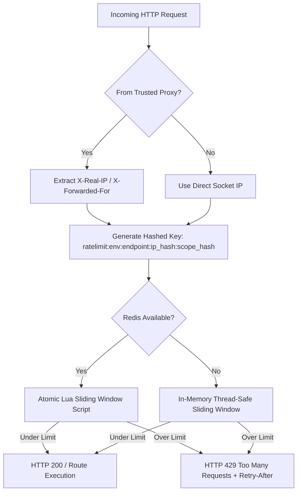

# Get My Moment — Redis-Backed Rate Limiting & Abuse Protection Architecture (SEC-02)

**Implementation Status:** `PRODUCTION VERIFIED`  
**Core Module:** `apps/api/services/rate_limiter.py`  
**Test Suite:** `tests/security/test_rate_limiting.py`  

---

## 1. ARCHITECTURE OVERVIEW

The Get My Moment rate-limiting layer utilizes an **atomic sliding-window counter algorithm** executed via Redis Lua scripting, with an in-memory thread-safe fallback engine when Redis is unreachable.

---

## 2. PROTECTED ENDPOINTS & CONFIGURABLE LIMITS

| Endpoint | Method | Tag | Default Initial Limit | Key Scoping Strategy | Failure Mode |
| :--- | :---: | :--- | :---: | :--- | :---: |
| `/api/v1/auth/login` | `POST` | `auth_login` | `5/minute` | `ip_{ip_hash}:acc_{email_hash}` | `fail-closed` (Memory) |
| `/api/v1/admin/auth/login` | `POST` | `admin_login` | `3/5minute` | `ip_{ip_hash}:adm_{email_hash}` | `fail-closed` (Memory) |
| `/api/v1/admin/gateway-settings/unlock` | `POST` | `admin_unlock` | `3/5minute` | `ip_{ip_hash}:adm_{admin_id_hash}` | `fail-closed` (Memory) |
| `/api/v1/events/{id}/guests/register` | `POST` | `guest_register` | `10/minute` | `ip_{ip_hash}:evt_{event_id_hash}` | `memory fallback` |
| `/api/v1/events/{id}/guests/login` | `POST` | `guest_login` | `10/minute` | `ip_{ip_hash}:evt_{event_id_hash}` | `memory fallback` |
| `/api/v1/events/{id}/guests/{id}/search` | `POST` | `face_search` | `10/minute` | `ip_{ip_hash}:evt_{evt_hash}_gst_{gst_hash}` | `memory fallback` |
| `/api/v1/events/public/by-token/{token}` | `GET` | `public_token` | `30/minute` | `ip_{ip_hash}:tok_{token_hash}` | `memory fallback` |
| `/api/v1/photos/{id}/download` | `GET` | `photo_download` | `40/minute` | `ip_{ip_hash}:tok_{token_hash}` | `memory fallback` |
| `/api/v1/events/{id}/download-all-zip` | `GET` | `zip_download` | `5/minute` | `ip_{ip_hash}:evt_{event_id_hash}` | `memory fallback` |

---

## 3. PRIVACY & SENSITIVE DATA DEFENSE

1. **Zero Secret Leakage:** Passwords, OTPs, raw JWT Bearer tokens, raw event access tokens, phone numbers, and facial embeddings are NEVER stored in Redis keys or logged.
2. **SHA-256 Scope Hashing:** Sensitive values are normalized and hashed via `hashlib.sha256(val.encode()).hexdigest()[:16]` before inclusion in rate limit keys.
3. **Automatic Expiration (TTL):** Redis keys have a strict TTL of `window + 1` seconds set automatically on every evaluation.

---

## 4. PROXY IP & SPOOFING PREVENTION

- Connecting socket IPs are matched against trusted CIDRs (`127.0.0.1/8`, `10.0.0.0/8`, `172.16.0.0/12`, `192.168.0.0/16`).
- Direct client header injections (e.g. spoofed `X-Forwarded-For` from untrusted direct sockets) are ignored.
- For requests proxied through the host Nginx server, `X-Real-IP` (populated from `$remote_addr`) is trusted.

---

## 5. MONITORING & TUNING

Limits can be adjusted via environment variables without code changes:
- `RATE_LIMIT_AUTH_LOGIN="10/minute"`
- `RATE_LIMIT_FACE_SEARCH="20/minute"`
- `RATE_LIMIT_PHOTO_DOWNLOAD="60/minute"`

