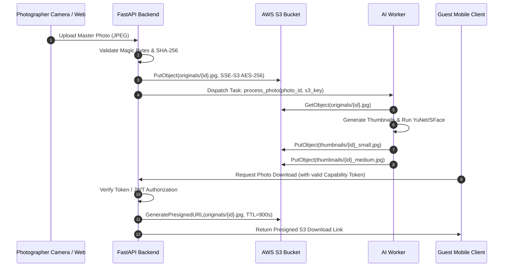

# Get My Moment — AWS S3 Storage Architecture (P1-BATCH-01)

**Status:** `ADAPTER IMPLEMENTED — PRODUCTION CUTOVER DEFERRED`  
**Configuration Driver:** `STORAGE_DRIVER=local` (Default) | `STORAGE_DRIVER=s3`  

---

## 1. DETERMINISTIC TENANT-SCOPED OBJECT KEY HIERARCHY

All S3 objects are strictly partitioned by tenant (`studio_id`) and event (`event_id`):

```text
getmymoment-photos-prod/
└── studios/{studio_id}/
    └── events/{event_id}/
        ├── originals/
        │   └── [{folder_id}/]{photo_uuid}.jpg
        ├── thumbnails/
        │   ├── [{folder_id}/]{photo_uuid}_small.jpg    # 400px JPEG
        │   └── [{folder_id}/]{photo_uuid}_medium.jpg   # 1200px JPEG
        ├── faces/
        │   └── {face_uuid}.jpg                         # Debug crops (if enabled)
        └── temp/
            └── {temp_uuid}.jpg                         # Ingestion buffers
```

---

## 2. INGESTION & ACCESS FLOW



